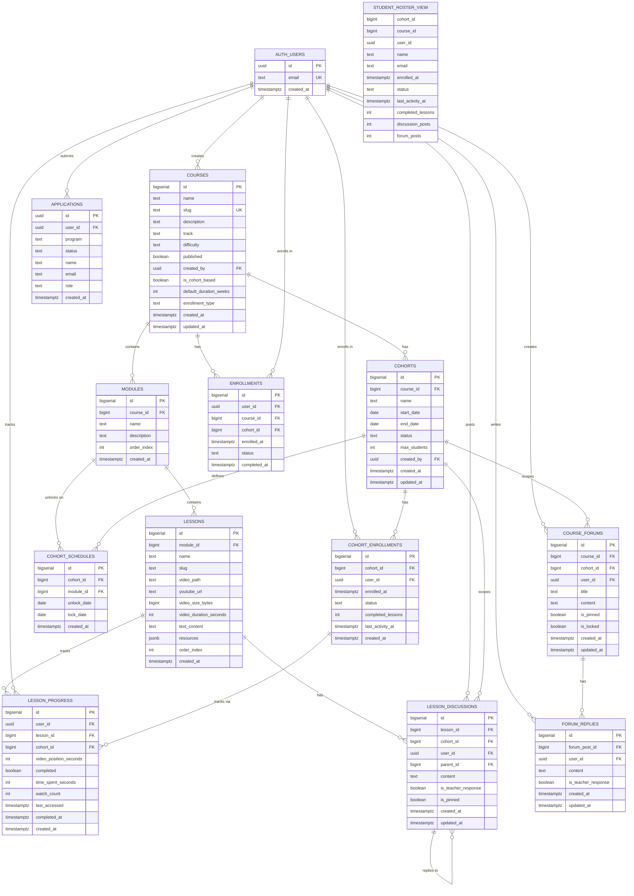

# Cohort System - Entity Relationship Diagram

**Version:** 1.0.0
**Date:** October 29, 2025
**Status:** Implementation Complete

---

## Overview

This ERD diagram shows the complete cohort system schema, including relationships to existing tables (courses, users, modules, lessons) and the six new cohort-related tables.

---

## Entity Relationship Diagram (Mermaid)



---

## Cardinality Relationships

### Core Relationships

| Parent Table | Child Table | Relationship | Cardinality | Notes |
|--------------|-------------|--------------|-------------|-------|
| courses | cohorts | One-to-Many | 1:N | A course can have multiple cohorts (e.g., "Fall 2025", "Spring 2026") |
| courses | modules | One-to-Many | 1:N | A course contains multiple modules |
| modules | lessons | One-to-Many | 1:N | A module contains multiple lessons |
| cohorts | cohort_enrollments | One-to-Many | 1:N | A cohort has many student enrollments |
| cohorts | cohort_schedules | One-to-Many | 1:N | A cohort defines unlock schedule for each module |
| cohorts | lesson_discussions | One-to-Many | 1:N | Discussions are scoped to a specific cohort |
| cohorts | course_forums | One-to-Many | 1:N | Forum posts are scoped to a cohort |

### User Relationships

| Parent Table | Child Table | Relationship | Cardinality | Notes |
|--------------|-------------|--------------|-------------|-------|
| auth.users | cohort_enrollments | One-to-Many | 1:N | A user can enroll in multiple cohorts |
| auth.users | lesson_progress | One-to-Many | 1:N | A user has progress for each lesson |
| auth.users | lesson_discussions | One-to-Many | 1:N | A user can post multiple discussions |
| auth.users | course_forums | One-to-Many | 1:N | A user can create multiple forum posts |
| auth.users | forum_replies | One-to-Many | 1:N | A user can write multiple replies |

### Unique Constraints (Prevent Duplicates)

| Table | Unique Constraint | Purpose |
|-------|------------------|---------|
| cohort_enrollments | (cohort_id, user_id) | Prevent duplicate enrollments in same cohort |
| cohort_schedules | (cohort_id, module_id) | One unlock schedule per module per cohort |
| lesson_progress | (user_id, lesson_id) | One progress record per user per lesson |
| enrollments | (user_id, course_id) | One enrollment per user per course (legacy) |

### Cascade Deletes

When a parent record is deleted, related child records are automatically deleted:

| Parent Deletion | Cascades To | Notes |
|----------------|-------------|-------|
| DELETE course | cohorts, modules, enrollments | Entire course structure removed |
| DELETE cohort | cohort_enrollments, cohort_schedules, lesson_discussions, course_forums | Clean up cohort-specific data |
| DELETE module | lessons, cohort_schedules | Module content and schedules removed |
| DELETE lesson | lesson_progress, lesson_discussions | Lesson data cleaned up |
| DELETE user | applications, enrollments, cohort_enrollments, lesson_progress, discussions | User data removed (GDPR compliance) |
| DELETE forum_post | forum_replies | Forum threads cleaned up |

### Self-Referencing Relationships

| Table | Relationship | Purpose |
|-------|--------------|---------|
| lesson_discussions | parent_id → id | Threaded replies (nested comments) |

**Constraint:** `parent_id` is nullable (NULL for top-level posts, references another discussion for replies)

---

## Table Indexes for Performance

### Cohort System Indexes

```sql
-- Cohorts
CREATE INDEX idx_cohorts_course_id ON cohorts(course_id);
CREATE INDEX idx_cohorts_status ON cohorts(status);
CREATE INDEX idx_cohorts_start_date ON cohorts(start_date);

-- Cohort Enrollments
CREATE INDEX idx_cohort_enrollments_cohort ON cohort_enrollments(cohort_id);
CREATE INDEX idx_cohort_enrollments_user ON cohort_enrollments(user_id);
CREATE INDEX idx_cohort_enrollments_status ON cohort_enrollments(status);
CREATE INDEX idx_cohort_enrollments_activity ON cohort_enrollments(last_activity_at DESC);

-- Cohort Schedules
CREATE INDEX idx_cohort_schedules_cohort ON cohort_schedules(cohort_id);
CREATE INDEX idx_cohort_schedules_module ON cohort_schedules(module_id);
CREATE INDEX idx_cohort_schedules_unlock ON cohort_schedules(unlock_date);

-- Lesson Discussions
CREATE INDEX idx_lesson_discussions_lesson ON lesson_discussions(lesson_id);
CREATE INDEX idx_lesson_discussions_cohort ON lesson_discussions(cohort_id);
CREATE INDEX idx_lesson_discussions_user ON lesson_discussions(user_id);
CREATE INDEX idx_lesson_discussions_parent ON lesson_discussions(parent_id);

-- Course Forums
CREATE INDEX idx_course_forums_course ON course_forums(course_id);
CREATE INDEX idx_course_forums_cohort ON course_forums(cohort_id);
CREATE INDEX idx_course_forums_user ON course_forums(user_id);

-- Forum Replies
CREATE INDEX idx_forum_replies_post ON forum_replies(forum_post_id);
CREATE INDEX idx_forum_replies_user ON forum_replies(user_id);

-- Lesson Progress (enhanced for cohort support)
CREATE INDEX idx_progress_cohort ON lesson_progress(cohort_id);
```

**Purpose:** These indexes optimize:
- Roster queries (by cohort)
- Student progress tracking (by user)
- Discussion retrieval (by lesson, cohort, or user)
- Forum queries (by course or cohort)
- Schedule lookups (by unlock date)

---

## Materialized View: Student Roster

### Purpose
Aggregate student enrollment data with progress metrics for fast roster queries.

### Definition
```sql
CREATE MATERIALIZED VIEW student_roster_view AS
SELECT
  ce.cohort_id,
  c.course_id,
  ce.user_id,
  a.name,
  a.email,
  ce.enrolled_at,
  ce.status,
  ce.last_activity_at,
  ce.completed_lessons,
  COUNT(DISTINCT ld.id) as discussion_posts,
  COUNT(DISTINCT cf.id) as forum_posts
FROM cohort_enrollments ce
JOIN applications a ON a.user_id = ce.user_id
JOIN cohorts c ON c.id = ce.cohort_id
LEFT JOIN lesson_discussions ld ON ld.user_id = ce.user_id AND ld.cohort_id = ce.cohort_id
LEFT JOIN course_forums cf ON cf.user_id = ce.user_id AND cf.cohort_id = ce.cohort_id
GROUP BY ce.cohort_id, c.course_id, ce.user_id, a.name, a.email, ce.enrolled_at, ce.status, ce.last_activity_at, ce.completed_lessons;

-- Indexes on materialized view
CREATE INDEX idx_roster_view_cohort ON student_roster_view(cohort_id);
CREATE INDEX idx_roster_view_course ON student_roster_view(course_id);
CREATE INDEX idx_roster_view_user ON student_roster_view(user_id);
```

### Refresh Strategy
```sql
-- Manual refresh (called by admin or scheduled job)
REFRESH MATERIALIZED VIEW CONCURRENTLY student_roster_view;

-- Helper function
CREATE OR REPLACE FUNCTION refresh_student_roster_view()
RETURNS void AS $$
BEGIN
  REFRESH MATERIALIZED VIEW CONCURRENTLY student_roster_view;
END;
$$ LANGUAGE plpgsql;
```

**When to refresh:**
- Nightly (scheduled job)
- After bulk enrollment operations
- On-demand from admin panel

---

## Key Design Decisions

### 1. Cohorts vs Direct Enrollments
- **Old:** Users enroll directly in courses via `enrollments` table
- **New:** Users enroll in cohorts via `cohort_enrollments` table
- **Hybrid Support:** Both methods supported via `courses.enrollment_type`:
  - `'open'` - Self-paced, no cohort required
  - `'cohort_only'` - Must join a cohort
  - `'hybrid'` - Both options available

### 2. Module-Level Time-Gating
- Schedules are defined per MODULE, not per lesson
- All lessons within a module unlock together
- Rationale: Simpler UX, easier to manage

### 3. Threaded Discussions
- `lesson_discussions.parent_id` enables nested replies
- NULL parent_id = top-level post
- No depth limit (database supports infinite nesting)
- UI should limit display depth (e.g., 3 levels)

### 4. Separate Forum System
- `course_forums` for course-wide discussions
- `lesson_discussions` for lesson-specific Q&A
- Different use cases, different tables

### 5. Teacher Response Flags
- `is_teacher_response` marks official teacher replies
- Helps students identify authoritative answers
- Can be highlighted in UI

### 6. Cohort-Specific Discussions
- Discussions are scoped to cohort (not course-wide)
- Prevents confusion between cohorts at different progress levels
- Students see only their cohort's discussions

---

## Status Enums

### Cohort Status
```sql
CHECK (status IN ('upcoming', 'active', 'completed', 'archived'))
```
- `upcoming` - Not started yet (start_date in future)
- `active` - Currently running (between start_date and end_date)
- `completed` - Finished (end_date passed)
- `archived` - Hidden from public view

**Auto-Update:** Trigger `auto_update_cohort_status` automatically sets status based on dates.

### Cohort Enrollment Status
```sql
CHECK (status IN ('active', 'completed', 'dropped', 'paused'))
```
- `active` - Student is actively participating
- `completed` - Student finished the cohort
- `dropped` - Student left before completion
- `paused` - Temporary leave (can resume)

---

## Data Flow Examples

### Example 1: Student Enrolls in Cohort
```
1. Student visits /courses/ai-safety-fundamentals
2. Clicks "Join Fall 2025 Cohort"
3. INSERT INTO cohort_enrollments (cohort_id, user_id, status) VALUES (1, user_uuid, 'active')
4. (Optional) INSERT INTO enrollments (user_id, course_id, cohort_id) VALUES (user_uuid, 1, 1)
5. Student can now see unlocked modules based on cohort_schedules
```

### Example 2: Module Unlocks on Schedule
```
1. cohort_schedules defines: module_id=5 unlocks on 2025-11-05
2. Student visits course page on 2025-11-06
3. Query checks: SELECT * FROM cohort_schedules WHERE cohort_id=1 AND module_id=5 AND unlock_date <= CURRENT_DATE
4. Module 5 is accessible
5. Student clicks lesson → lesson_progress record created
```

### Example 3: Teacher Views Roster
```
1. Teacher visits /teacher/courses → "Students" tab
2. Query: SELECT * FROM student_roster_view WHERE cohort_id=1 ORDER BY last_activity_at DESC
3. Returns: name, email, enrolled_at, completed_lessons, discussion_posts, forum_posts
4. Teacher sees engagement metrics at a glance
```

### Example 4: Student Posts Discussion
```
1. Student watches lesson, clicks "Ask a question"
2. INSERT INTO lesson_discussions (lesson_id, cohort_id, user_id, content) VALUES (10, 1, user_uuid, 'How do I...')
3. Other students in same cohort can see and reply
4. Reply: INSERT INTO lesson_discussions (lesson_id, cohort_id, user_id, parent_id, content) VALUES (10, 1, user2_uuid, 123, 'You can...')
5. Threaded discussion displayed in UI
```

---

## Performance Considerations

### Expected Query Patterns

**Most Frequent Queries:**
1. Get student's enrolled cohorts: `SELECT * FROM cohort_enrollments WHERE user_id = ?`
2. Get cohort roster: `SELECT * FROM student_roster_view WHERE cohort_id = ?`
3. Get unlocked modules: `SELECT * FROM cohort_schedules WHERE cohort_id = ? AND unlock_date <= CURRENT_DATE`
4. Get lesson discussions: `SELECT * FROM lesson_discussions WHERE lesson_id = ? AND cohort_id = ?`

**Optimization:**
- All primary query patterns covered by indexes
- Materialized view pre-aggregates roster data
- Foreign keys ensure referential integrity without full table scans

### Scalability Targets

| Metric | Target | Notes |
|--------|--------|-------|
| Students per cohort | 500 | Max recommended for interactive cohorts |
| Cohorts per course | 50 | Supports 5+ years of cohorts |
| Discussions per lesson | 1000 | Typical large cohort discussion volume |
| Roster query time | <200ms | With materialized view + indexes |
| Enrollment operation | <100ms | Single INSERT with constraints |

---

## Related Documentation

- [RLS Policies](../security/cohort-rls-policies.md) - Row-level security details
- [Migration Guide](../migrations/001-add-cohort-system.md) - Upgrade instructions
- [API Usage](../api/cohorts.md) - Code examples for cohort operations
- [ROADMAP.md](../../ROADMAP.md) - Implementation timeline

---

## Changelog

**v1.0.0 (2025-10-29)**
- Initial cohort system schema
- 6 new tables (cohorts, cohort_enrollments, cohort_schedules, lesson_discussions, course_forums, forum_replies)
- Materialized view for roster queries
- 14+ indexes for performance
- RLS policies for security
- Triggers for auto-updates

---

**Diagram Generated:** October 29, 2025
**Schema Version:** 1.0.0
**Status:** Production Ready
